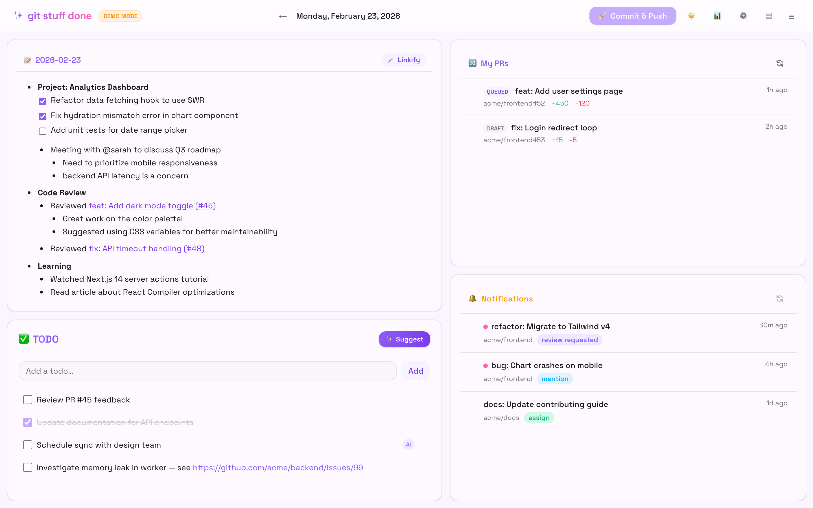
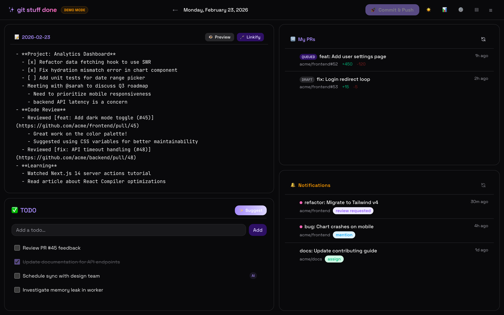
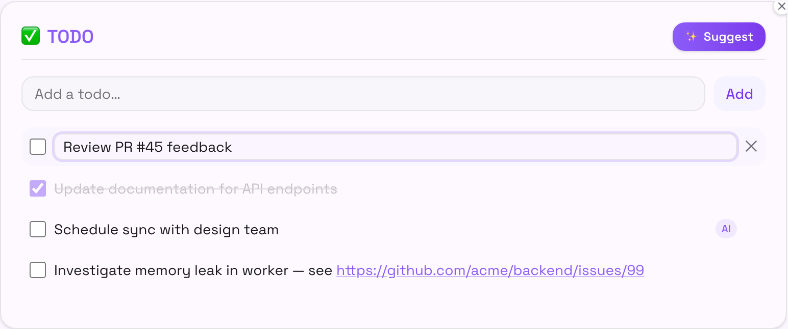
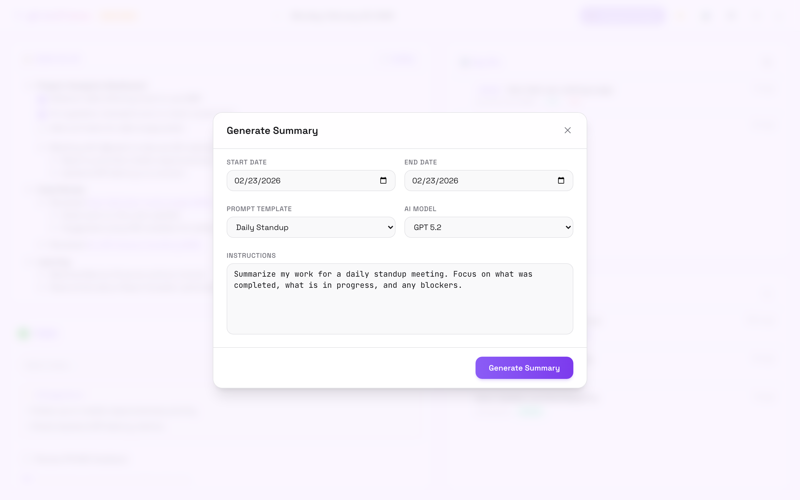
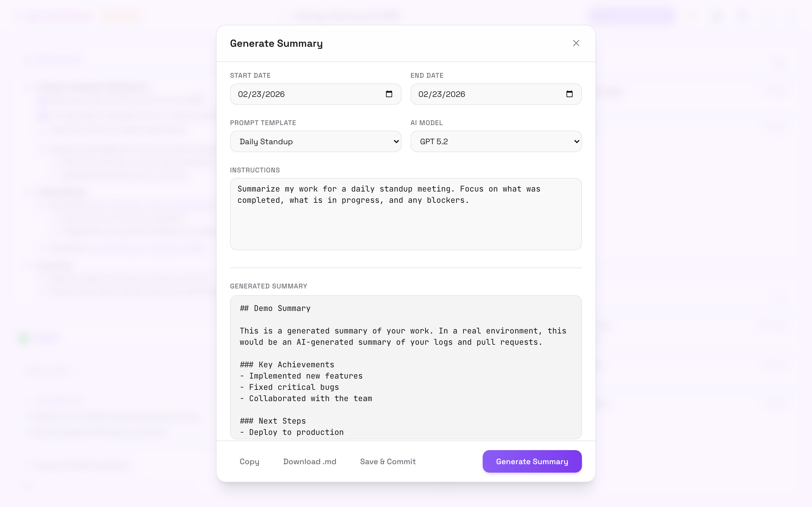
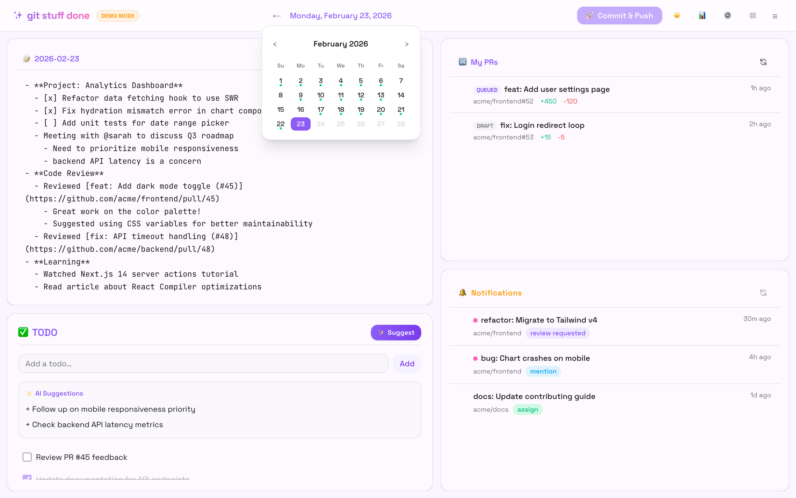
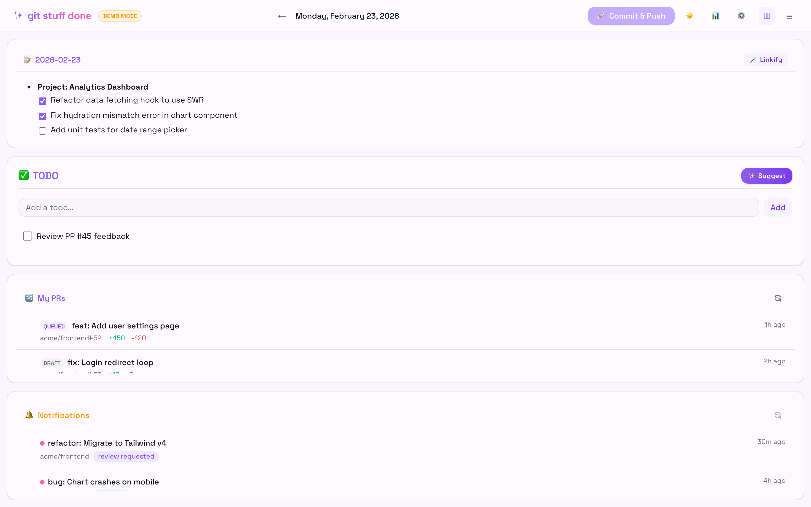

# ✨ git-stuff-done

**git-stuff-done** is your personal developer dashboard designed to keep you in the flow. It combines a distraction-free markdown editor for your daily work logs with AI superpowers. Track your work, manage your PRs and GitHub notifications, and generate work summaries all in one place.


## Features

- **📝 Work Log Editor** — Write markdown with smart bullet points (Tab to indent, Enter to continue). Auto-saves as you type. Toggle between **Edit** and **Preview** modes to see your rendered markdown.
- **📅 Date Navigation** — Browse past logs with a calendar picker. Dates that have content show a dot indicator. Use ← / → to step day by day, or click **Today** to jump back.
- **🪄 Linkify** — Click **🪄 Linkify** to resolve bare GitHub URLs to titled markdown links. Updates the log in-place.
- **📊 Work Log Summary** — Generate AI-powered summaries of your work logs for daily standups or weekly reports. Choose the AI model, pick a date range, and **save summaries** directly to your repo in `summaries/`.
- **✅ TODO List** — Manual TODOs with inline editing + AI-suggested action items based on your work log.
- **🔀 My PRs** — Live feed of your open PRs (including drafts and merge queue status) in your GitHub org. Click the insert button on any PR to paste its link at the cursor in your work log.
- **🔔 Notifications** — Filtered GitHub notifications: reviews requested, mentions, assignments, and activity on your issues/PRs. Click the insert button to paste a link at the cursor.
- **🚀 Auto-commit & Push** — Hourly auto-commit of your logs and TODOs to a git repo, with push to remote.
- **⚙️ Settings** — Ignore noisy repos in notifications.
- **▤ Layout modes** — Toggle between grid (2-column) and column (single-column) layouts. Hide individual panels and restore them from the ☰ menu. Preferences are saved in localStorage.
- **🌗 Dark Mode** — First-class support for both light and dark themes.

## Prerequisites

- **Node.js** 20+
- **GitHub Copilot CLI** (`copilot`) — installed and in your PATH. The SDK communicates with the CLI in server mode for AI features.
  - [Installation guide](https://docs.github.com/en/copilot/how-tos/set-up/install-copilot-cli)
  - Requires a GitHub Copilot subscription (free tier available)
- **A GitHub Personal Access Token (PAT)** with read-only scopes — see setup step 2 below.
- **GitHub CLI** (`gh`) — optional, only needed if you skip the PAT step. If present and authenticated, it's used as a fallback for GitHub API access.

## Setup

1. **Fork, then clone your fork:**

   Click **Fork** on GitHub to create your own copy of this repo, then clone it:
   ```bash
   git clone https://github.com/<your-username>/git-stuff-done git-stuff-done
   cd git-stuff-done
   npm install
   ```

   > ⚠️ Do not clone this repo directly — the auto-commit feature pushes to the git remote, and you won't have push access to the original repo.

2. **Create a read-only GitHub PAT:**

   Go to https://github.com/settings/personal-access-tokens/new and create a fine-grained token with:
   - **Repository access:** Public repositories (or select specific repos if needed)
   - **Permissions:** `Issues` → Read-only, `Pull requests` → Read-only, `Notifications` → Read-only

   If your org requires SSO, click **Configure SSO** → **Authorize** for your org after creating the token.

3. **Configure environment:**
   ```bash
   cp .env.example .env.local
   ```
   Edit `.env.local`:
   - `GITHUB_READ_TOKEN` — the PAT from step 2
   - `GITHUB_ORG` — your GitHub org name (filters notifications, PRs, links)
   - `GIT_STUFF_DONE_DATA_DIR` — (recommended) path to a separate git repo for storing logs/TODOs

4. **Set up a separate repo for your logs (recommended):**

   Without `GIT_STUFF_DONE_DATA_DIR`, logs and TODOs are stored inside the app repo itself (your fork). To keep them separate:

   Create a new private repo on GitHub for your logs, then clone it:
   ```bash
   git clone https://github.com/<your-username>/my-work-logs ~/my-work-logs
   ```

   Set `GIT_STUFF_DONE_DATA_DIR=~/my-work-logs` in `.env.local`. The directory must be a git repo with a remote for auto-push to work.

5. **Run the dashboard:**
   ```bash
   npm run dev
   ```
   Open http://localhost:3000

## Environment Variables

| Variable | Default | Description |
|----------|---------|-------------|
| `GITHUB_ORG` | *(none)* | GitHub org to filter notifications, PRs, and links |
| `GITHUB_READ_TOKEN` | *(falls back to `gh auth token`)* | Read-only GitHub token ([create one](https://github.com/settings/personal-access-tokens/new) with Issues, PRs, and Notifications read access) |
| `GIT_STUFF_DONE_DATA_DIR` | `./` (app dir) | Path to a git repo where `logs/` and `data/` will be stored |

## How It Works

- **Storage:** Daily logs are saved as `logs/YYYY-MM-DD.md`. Summaries are saved in `summaries/YYYY-MM-DD-{type}.md`. TODOs live in `data/todos.json`. Settings in `data/config.json`.
- **Linkify:** Click **🪄 Linkify** in the log panel. Resolves bare GitHub URLs to titled markdown links (e.g. `[Fix auth bug (#123)](url)`). Saves the result back to the same file.
- **Auto-commit:** Every hour while the app is running, changes to `logs/`, `summaries/`, and `data/` are committed and pushed. You can also trigger a manual commit via the 🚀 button.
- **Timezone:** All dates use America/Los_Angeles (Pacific Time). Edit `getTodayDate()` in `src/lib/files.ts` to change.

## Tech Stack

- Next.js 16 (App Router) + TypeScript
- Tailwind CSS v4
- `@github/copilot-sdk` for AI summaries
- Space Grotesk + JetBrains Mono fonts
- Octokit for GitHub API
- react-resizable-panels for layout

## Screenshots

| Light Mode | Dark Mode |
| :---: | :---: |
|  |  |


|  AI-Suggested TODOs ||
| :---: | :---: |
|  |  |

| AI Summaries |  |
| :---: | :---: |
|  |  |

| Calendar Picker | Alternate Layout |
| :---: | :---: |
|  |  |
