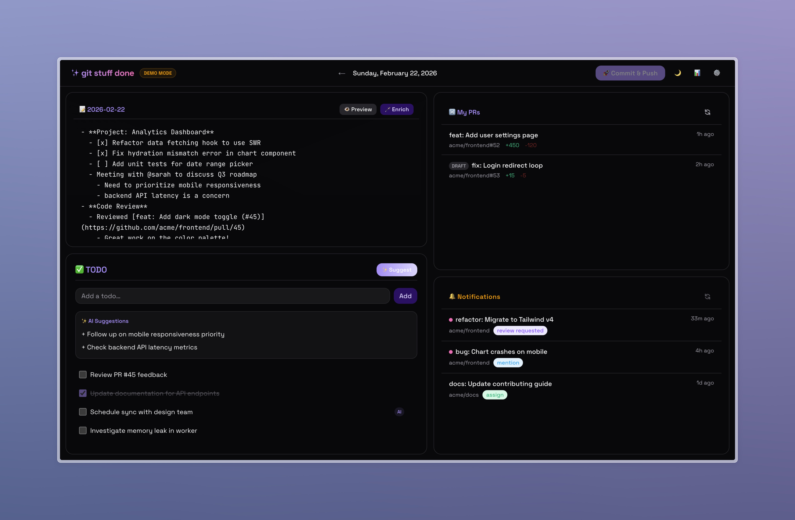
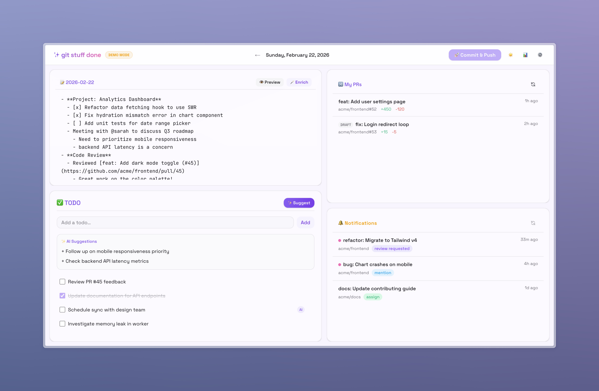

# git-stuff-done ✨

**git-stuff-done** is your personal developer dashboard designed to keep you in the flow. It combines a distraction-free markdown editor for your daily work logs with AI superpowers. Automatically track your work, enrich your notes with context from GitHub, manage your PRs and notifications, and generate standup summaries—all without leaving your local environment. It's like a flight recorder for your engineering day.

## Screenshots

| Dark Mode | Light Mode |
| :---: | :---: |
|  |  |

| Generate AI summaries for a given date range | AI Suggested TODOs |
| :---: | :---: |
|  |  |

## Features

- **📝 Work Log Editor** — Write markdown with smart bullet points (Tab to indent, Enter to continue). Auto-saves as you type. Toggle between **Edit** and **Preview** modes to see your rendered markdown.
- **🪄 AI Enrichment** — Click **🪄 Enrich** to resolve GitHub links to titles and expand bullet points via the Copilot SDK. Updates the log in-place.
- **📊 Work Log Summary** — Generate AI-powered summaries of your work logs for daily standups or weekly reports. **Save summaries** directly to your repo in `summaries/` folder.
- **✅ TODO List** — Manual TODOs with inline editing + AI-suggested action items based on your work log.
- **🔀 My PRs** — Live feed of your open PRs (including drafts) in your GitHub org.
- **🔔 Notifications** — Filtered GitHub notifications: reviews requested, mentions, assignments, and activity on your issues/PRs.
- **🚀 Auto-commit & Push** — Hourly auto-commit of your logs and TODOs to a git repo, with push to remote.
- **⚙️ Settings** — Ignore noisy repos in notifications.
- **🌗 Dark Mode** — First-class support for both light and dark themes.

## Prerequisites

- **Node.js** 20+
- **GitHub Copilot CLI** (`copilot`) — installed and in your PATH. The SDK communicates with the CLI in server mode for AI features.
  - [Installation guide](https://docs.github.com/en/copilot/how-tos/set-up/install-copilot-cli)
  - Requires a GitHub Copilot subscription (free tier available)
- **A GitHub Personal Access Token (PAT)** with read-only scopes — see setup step 2 below.
- **GitHub CLI** (`gh`) — optional, only needed if you skip the PAT step. If present and authenticated, it's used as a fallback for GitHub API access.

## Setup

1. **Fork, then clone your fork:**

   Click **Fork** on GitHub to create your own copy of this repo, then clone it:
   ```bash
   git clone https://github.com/<your-username>/git-stuff-done git-stuff-done
   cd git-stuff-done
   npm install
   ```

   > ⚠️ Do not clone this repo directly — the auto-commit feature pushes to the git remote, and you won't have push access to the original repo.

2. **Create a read-only GitHub PAT:**

   Go to https://github.com/settings/personal-access-tokens/new and create a fine-grained token with:
   - **Repository access:** Public repositories (or select specific repos if needed)
   - **Permissions:** `Issues` → Read-only, `Pull requests` → Read-only, `Notifications` → Read-only

   If your org requires SSO, click **Configure SSO** → **Authorize** for your org after creating the token.

3. **Configure environment:**
   ```bash
   cp .env.example .env.local
   ```
   Edit `.env.local`:
   - `GITHUB_READ_TOKEN` — the PAT from step 2
   - `GITHUB_ORG` — your GitHub org name (filters notifications, PRs, links)
   - `GIT_STUFF_DONE_DATA_DIR` — (recommended) path to a separate git repo for storing logs/TODOs

4. **Set up a separate repo for your logs (recommended):**

   Without `GIT_STUFF_DONE_DATA_DIR`, logs and TODOs are stored inside the app repo itself (your fork). To keep them separate:

   Create a new private repo on GitHub for your logs, then clone it:
   ```bash
   git clone https://github.com/<your-username>/my-work-logs ~/my-work-logs
   ```

   Set `GIT_STUFF_DONE_DATA_DIR=~/my-work-logs` in `.env.local`. The directory must be a git repo with a remote for auto-push to work.

5. **Run the dashboard:**
   ```bash
   npm run dev
   ```
   Open http://localhost:3000

## Environment Variables

| Variable | Default | Description |
|----------|---------|-------------|
| `GITHUB_ORG` | *(none)* | GitHub org to filter notifications, PRs, and links |
| `GITHUB_READ_TOKEN` | *(falls back to `gh auth token`)* | Read-only GitHub token ([create one](https://github.com/settings/personal-access-tokens/new) with Issues, PRs, and Notifications read access) |
| `GIT_STUFF_DONE_DATA_DIR` | `./` (app dir) | Path to a git repo where `logs/` and `data/` will be stored |

## How It Works

- **Storage:** Daily logs are saved as `logs/YYYY-MM-DD.md`. Summaries are saved in `summaries/YYYY-MM-DD-{type}.md`. TODOs live in `data/todos.json`. Settings in `data/config.json`.
- **AI Enrichment:** Click **🪄 Enrich** in the log panel. Uses `@github/copilot-sdk` (via Copilot CLI) to resolve GitHub links to issue/PR titles and expand bullet points. Saves the enriched result back to the same file.
- **Auto-commit:** Every hour while the app is running, changes to `logs/`, `summaries/`, and `data/` are committed and pushed. You can also trigger a manual commit via the 🚀 button.
- **Timezone:** All dates use America/Los_Angeles (Pacific Time). Edit `getTodayDate()` in `src/lib/files.ts` to change.

## Security

- **Read-only GitHub access:** For GitHub API calls (issues, PRs, notifications), use a fine-grained PAT with read-only permissions via `GITHUB_READ_TOKEN`. This ensures the app can never modify your repos.
- **No shell injection:** All subprocess calls use `execFileSync` (array arguments, no shell interpretation).
- **Path traversal protection:** All date parameters are validated against `YYYY-MM-DD` format.
- **Local only:** The app runs on `localhost` with no authentication. Do not expose it to the internet.

## Tech Stack

- Next.js 16 (App Router) + TypeScript
- Tailwind CSS v4
- `@github/copilot-sdk` for AI enrichment
- Space Grotesk + JetBrains Mono fonts
- Octokit for GitHub API
- react-resizable-panels for layout
