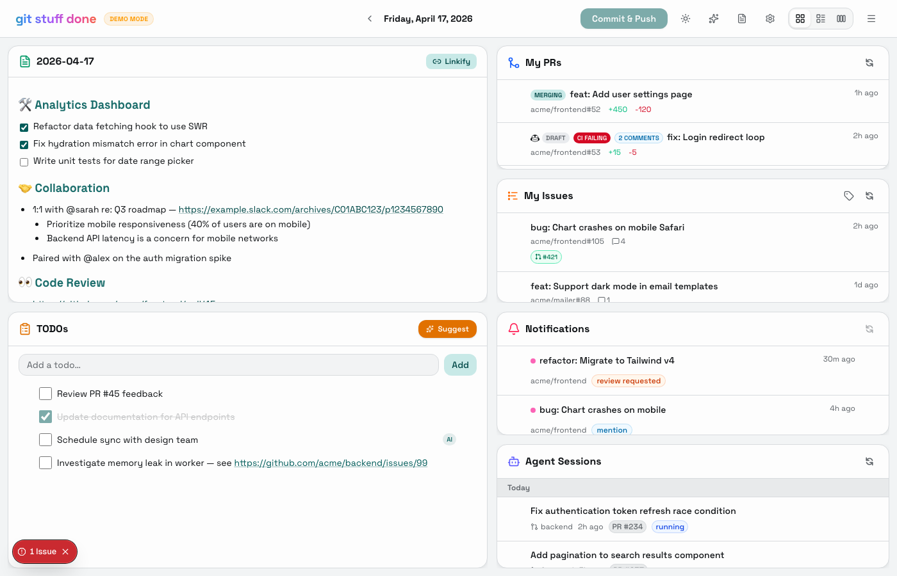
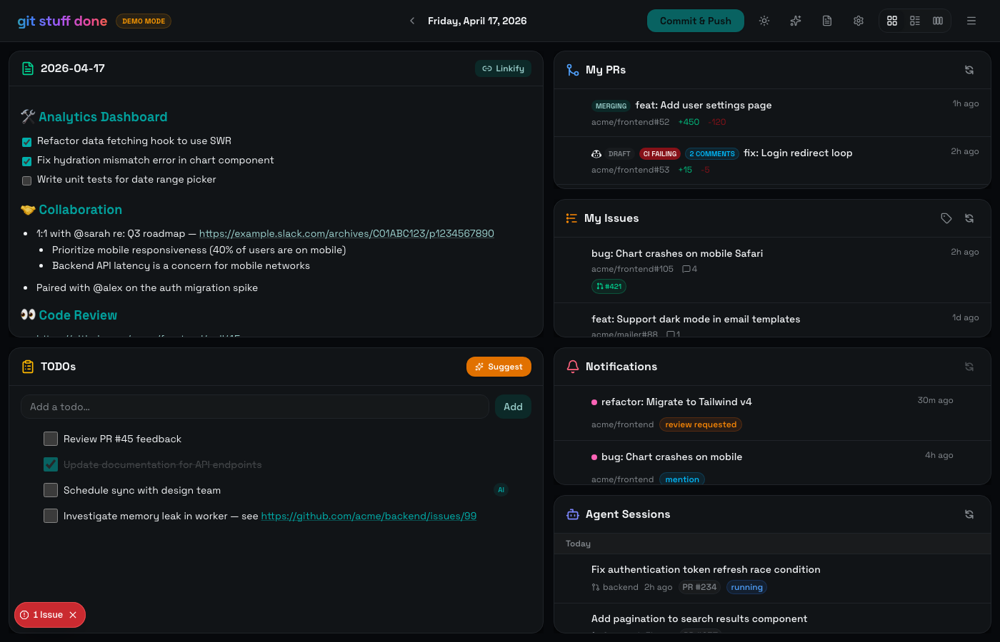

# ✨ git-stuff-done

**git-stuff-done** is your personal developer dashboard designed to keep you in the flow. It combines a distraction-free markdown editor for your daily work logs with AI superpowers. Track your work, manage your PRs and GitHub notifications, and generate work summaries all in one place.

### 👉 [check out the demo](https://therzka.github.io/git-stuff-done/) 👈

(or see [screenshots](#screenshots) below)

## Features

- **📝 Work Log Editor** — Hybrid markdown editor with inline rendering. Supports drag-and-drop images, `@mention` autocomplete for GitHub org members, Slack thread previews, and turning text into links (select text and paste a URL, or type `[label](url)` markdown syntax directly).
- **✨ AI Assistant** — Summarize your work logs for standups or weekly reports with built-in prompt templates plus saveable, reusable custom prompts. Also includes **Export Raw Logs** — download all work log entries for any date range as a single combined markdown file.
- **🔎 Search** — Search across all logs with natural language queries from the dedicated search modal.
- **✅ TODO List** — Manual TODOs and AI-suggested action items based on your work log.
- **🔀 My PRs** — Live feed of your open PRs with status badges and filter pills (Approved, Merging, Draft, Needs Review, Changes Requested, CI Failing, Copilot).
- **🐛 My Issues** — Open issues assigned to you with linked PR status and one-click Copilot agent assignment.
- **🔔 Notifications** — Filtered GitHub notifications for reviews, mentions, and assignments.
- **🤖 Agent Sessions** — Browse recent Copilot Cloud Agent sessions with summaries and PR/commit links.
- **📝 Scratchpad** — Persistent free-form markdown editor that lives across all days, with a built-in linkify action for turning bare GitHub and Slack links into richer markdown links.
- **🚀 Auto-commit & Push** — Hourly auto-commit of your logs and TODOs to a git repository
- **📊 Daily Activity** — Auto-generated end-of-day log appended to your work log: a factual list of all your GitHub activity that day (issues/PRs opened, closed, and merged; PR reviews given; comments on issues and PRs; commits pushed — including Copilot agent PRs), a bullet-point summary of Slack messages you sent (grouped by channel and thread, reasoning about the context of each thread, optionally restricted to a **Slack Channels** allowlist in Settings), and a `### Mentions` section summarizing Slack messages where others `@mention` you across **every** channel and DM (bot-authored mentions are filtered out). The Slack summary includes the real surrounding conversation for each thread (not just the message you sent), so the summary better reflects what was actually being discussed. Any GitHub PR/issue links mentioned in Slack are linkified using the same convention as elsewhere in the app. Runs automatically each evening and on demand via the **Daily activity** button. A standalone copy is also saved to `summaries/` later each evening.


## Prerequisites

- **Node.js** 20+
- **GitHub Copilot CLI** (`copilot`) in your PATH — [installation guide](https://docs.github.com/en/copilot/how-tos/set-up/install-copilot-cli)
- **GitHub Personal Access Token** with Issues, PRs, Notifications, Actions, and Contents scopes (write access required for Copilot agent assignment)
- **GitHub CLI** (`gh`) — optional fallback for GitHub API access
- **gh-slack extension** — optional, enables Slack thread viewing and the Daily Activity Slack summary: `gh extension install https://github.com/rneatherway/gh-slack`, then run `eval $(gh-slack auth -t <your-slack-team>)` once to authenticate.


## Setup

1. **Fork, then clone your fork:**

   ```bash
   git clone https://github.com/<your-username>/git-stuff-done git-stuff-done
   cd git-stuff-done
   npm install
   ```

   > ⚠️ Do not clone this repo directly — auto-commit pushes to your git remote.

2. **Create a GitHub PAT** at https://github.com/settings/personal-access-tokens/new with Issues, Pull requests, Notifications, Actions, and Contents permissions. If your org requires SSO, authorize the token for your org.

3. **Configure environment:**

   ```bash
   cp .env.example .env.local
   ```

   Edit `.env.local`:
   - `GITHUB_READ_TOKEN` — the PAT from step 2
   - `GITHUB_ORG` — your GitHub org name
   - `GIT_STUFF_DONE_DATA_DIR` — (recommended) path to a separate git repo for logs/TODOs

4. **Run the dashboard:**
   ```bash
   npm run dev
   ```
   Open http://localhost:3000

## Environment Variables

| Variable                  | Default                           | Description                                                             |
| ------------------------- | --------------------------------- | ----------------------------------------------------------------------- |
| `GITHUB_ORG`              | _(none)_                          | GitHub org to filter notifications, PRs, and links                      |
| `GITHUB_READ_TOKEN`       | _(falls back to `gh auth token`)_ | GitHub PAT with Issues, PRs, Notifications, Actions, Contents scopes    |
| `GIT_STUFF_DONE_DATA_DIR` | `./` (app dir)                    | Path to a git repo where `logs/` and `data/` will be stored             |
| `DAILY_ACTIVITY_MODEL`    | `gpt-4.1`                         | Model used to summarize Slack activity for the daily log                |
| `SLACK_TEAM`              | _(falls back to first `GITHUB_ORG` value)_ | Slack team name passed to `gh slack`, used to search your Slack activity for the daily log |

The evening hour Daily Activity generation runs at is configurable via `dailyActivityHour` in `data/config.json` (default `18`, local Pacific time). A standalone summary file copy is saved later via `dailySummaryFileHour` (default `20`). By default, the Slack summary checks every public channel you posted in; to restrict it to specific channels, add them to the **Slack Channels** allowlist in the Settings panel (or `slackChannels` in `data/config.json`).


## Screenshots

|                     Light Mode                      |                     Dark Mode                      |
| :-------------------------------------------------: | :------------------------------------------------: |
|  |  |
